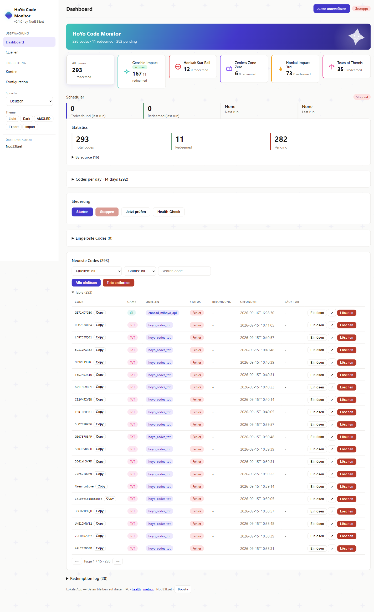
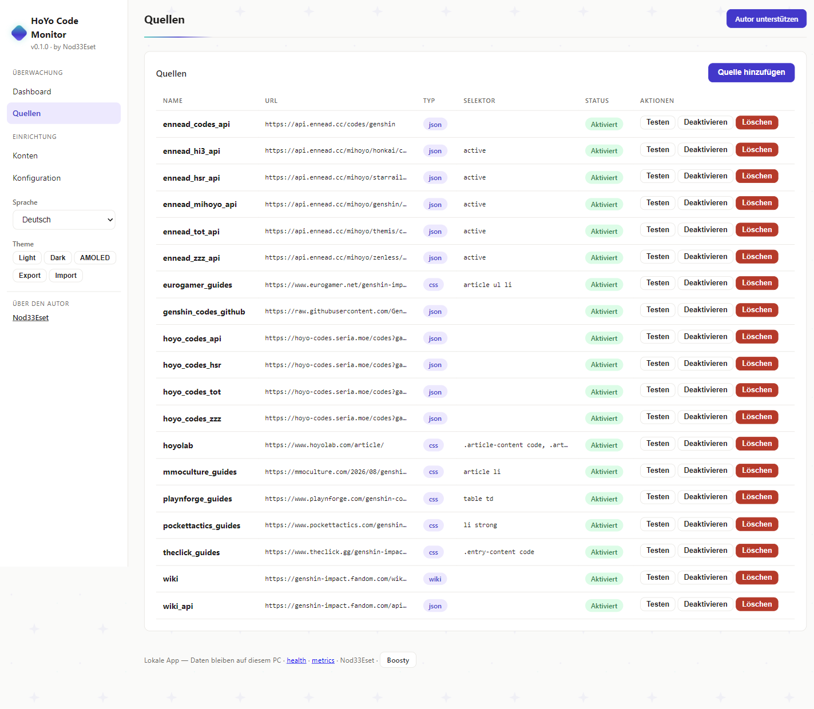
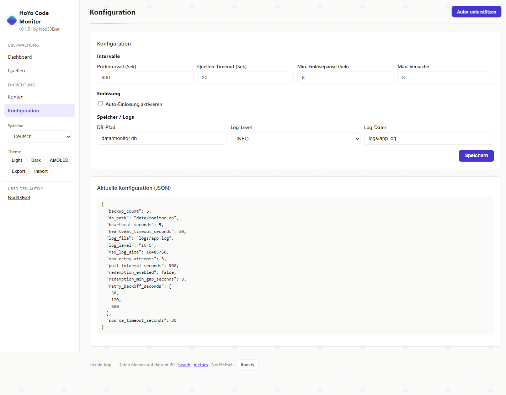
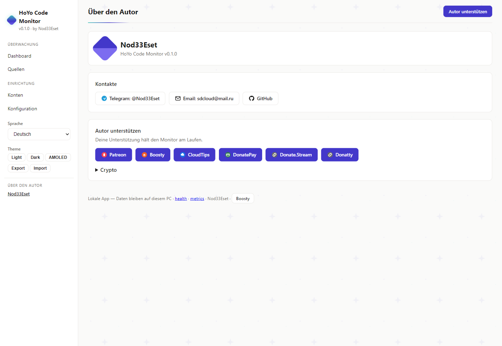

# HoYo Code Monitor

[](https://github.com/retvil/hoyo-code-monitor/releases) [](LICENSE) [](https://github.com/retvil/hoyo-code-monitor/releases)

**Verpassen Sie nie wieder einen HoYoverse-Promocode — lokale Überwachung und Auto-Einlösung für 5 Spiele, direkt auf Ihrem PC.**

[🇬🇧 English](README.md) | [🇷🇺 Русский](README.ru.md) | **🇩🇪 Deutsch** | [🇫🇷 Français](README.fr.md) | [🇯🇵 日本語](README.ja.md) | [🇨🇳 中文](README.zh.md)

## Was ist das?

HoYoverse-Spiele veröffentlichen regelmäßig zeitlich begrenzte Promocodes — und sie laufen schnell ab. **HoYo Code Monitor** überwacht 16 Code-Quellen in 5 Spielen (Genshin Impact, Honkai: Star Rail, Zenless Zone Zero, Honkai Impact 3rd, Tears of Themis) und löst neue Codes automatisch auf Ihren Konten ein. Alles läuft lokal auf Ihrem PC: SQLite-Datenbank, verschlüsselte Cookies, keine Telemetrie, keine Cloud.

### So funktioniert es

1. Der Planer fragt aktivierte Quellen ab, extrahiert Codes (`[A-Z0-9]{8,14}`), speichert neue.
2. Für jedes Konto mit aktivierter Auto-Einlösung: `GET webExchangeCdkey` mit Konto-Cookies, 8s Pause zwischen Einlösungen.
3. Ergebnis wird protokolliert: `success` → Done + Belohnung; `-2017/-2018` → bereits eingelöst (zählt als Done); `-2001` abgelaufen, `-2003` ungültig/nur China.

## Funktionen

- **Hintergrundüberwachung** — prüft Quellen alle N Minuten (konfigurierbar, Standard 15)
- **Auto-Einlösung** — löst neue Codes über die Hoyolab `webExchangeCdkey` API ein (opt-in, pro Konto)
- **Multi-Source** — Wiki, Wiki-API, Community-JSON-APIs, Guide-Seiten (16 Presets)
- **Multi-Account** — jedes Konto hat eigene verschlüsselte Cookies und eigenen Schalter
- **Statistik** — gesamt / eingelöst / ausstehend, pro Quelle, Einlöseprotokoll
- **Web UI** — lokales Dashboard unter `http://127.0.0.1:8000` in 6 Sprachen
- **System Tray** — Symbol mit Ein/Aus, Scanintervall-Menü, Einstellungen per Klick
- **Verschlüsselte Cookies** — Fernet (AES-128), Schlüssel in env / OS-Keyring / lokaler Datei
- **Autostart** — optionaler Windows-Login-Autostart

## Screenshots

<details>
<summary>Dashboard / Quellen / Config / Autor</summary>

| Dashboard | Quellen | Config |
|---|---|---|
|  |  |  |

| Autor |
|---|
|  |

</details>

## Quellen (live geprüft)

| Quelle | Typ | Status |
|---|---|---|
| Genshin Wiki (Fandom) | CSS | Kann 403 liefern (Fandom-Schutz) |
| Genshin Wiki API | JSON | Funktioniert |
| `hoyo-codes.seria.moe` | JSON API | Funktioniert |
| `api.ennead.cc` (2 Endpunkte) | JSON API | Funktioniert |
| Pocket Tactics, TheClick, Eurogamer, MMO Culture, Playnforge | CSS-Guides | Funktionieren |

## Fertige Builds

Installer aus [Releases](https://github.com/retvil/hoyo-code-monitor/releases) herunterladen:

- **Windows** — `hoyo-code-monitor-1.0.0-beta.3-setup.exe` (Installation pro Benutzer, keine Adminrechte nötig)

Stille Installation: `setup.exe /S`. Optionale Komponenten: Desktop-Verknüpfung, Windows-Autostart.

> **Hinweis:** Beim ersten Browser-Login lädt die App Chromium herunter (~170MB, einmalig).

## Schnellstart

```powershell
# 1. Installieren und starten — die App lebt im System-Tray
# 2. Konto hinzufügen (Region: os_usa / os_euro / os_asia / os_cht)
genshin-code-monitor accounts add main <UID> <REGION>

# 3. Cookies einmal erfassen (Browser öffnet sich, einmal einloggen)
genshin-code-monitor accounts login main

# 4. Auto-Einlösung aktivieren (oder Schalter pro Konto in der Web UI)
genshin-code-monitor config set redemption_enabled true
```

5. Dashboard öffnen: `http://127.0.0.1:8000` — Dashboard, Sources, Accounts, Config (Sprachumschalter EN/RU/DE/FR/JA/ZH in der Seitenleiste).

## Installation aus Quellen

Python 3.11+ erforderlich ([python.org](https://python.org)).

```powershell
pip install -e .
# Playwright-Browser für JS-Quellen (optional)
python -m playwright install chromium
```

Tray-Modus (empfohlen) / Einzelprüfung / Web UI:

```powershell
genshin-code-monitor tray
genshin-code-monitor run-once
python -m uvicorn src.web_ui:app --host 127.0.0.1 --port 8000
```

## FAQ

- **Code bleibt Pending?** Cookies prüfen (laufen ab), `redemption_enabled`, Kontoschalter und Fehler im Einlöseprotokoll.
- **`-1071 "Please log in"`?** `accounts login` wiederholen — Cookie-Satz unvollständig.
- **Wo sind die Daten?** `data/monitor.db`, `config.toml`, `logs/`, `data/.key`. Für Backup `data/` kopieren.

## Autor & Unterstützung

Siehe den Block „Über den Autor" im Dashboard der App oder unten:

**Krypto:**

- BTC: `bc1qunld3rsp37qf5gg69aune50y0qqkd0eugg7j97`
- TON: `UQDmvr4SKOxSION3Yky6aOgzAnCDXySPuAbG4EKJa5JUT7tC`
- USDT (TRC20): `TBPJSSLu1mUcX54g9UyxUohYGf2fuRvbwd`
- USDT (ERC20): `0x25CAED3776Ef5b18E03392bC5b254Bbd78E8180C`
- USDT (SOL): `3qgN5z291CEcj2FUi2Zza5DioxKgNw72kC7P52pCcTrG`

## Lizenz

MIT
