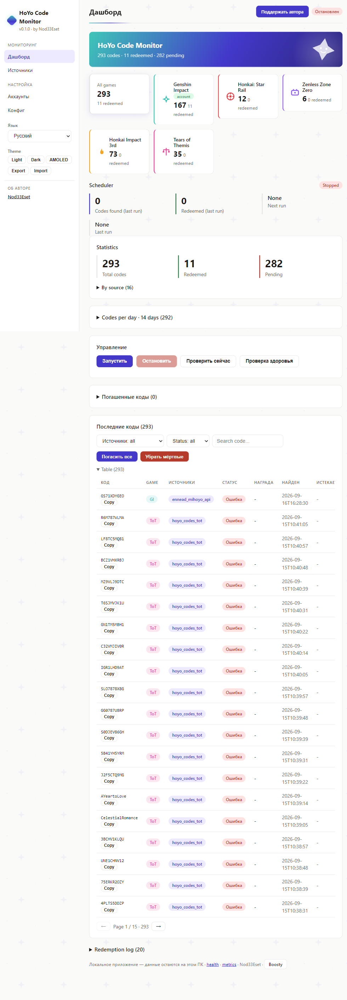
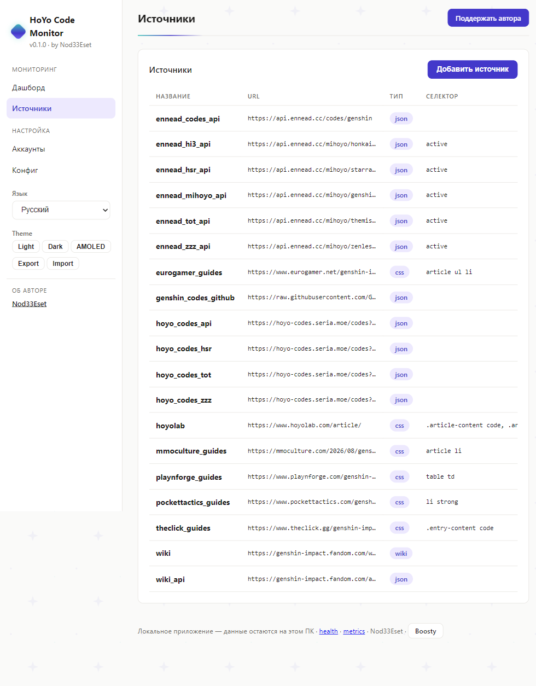
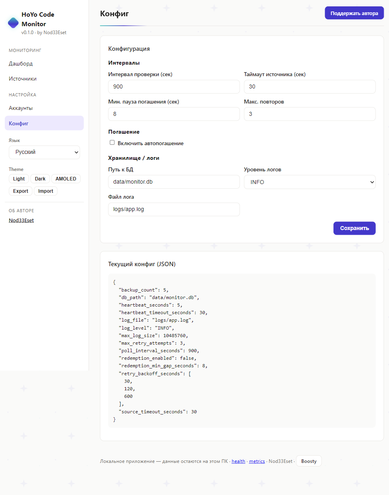
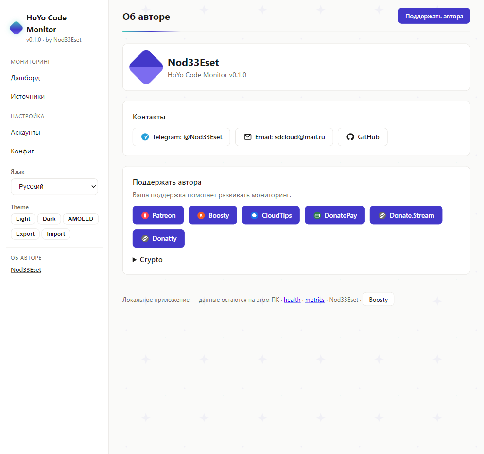

# HoYo Code Monitor

Application Windows locale qui surveille les sources de codes promo Genshin Impact et échange automatiquement les nouveaux codes via l'API Hoyolab. Tout reste sur votre PC : base SQLite, cookies chiffrés, aucune télémétrie, aucun cloud.

> Lire en : [English](README.md) · [Русский](README.ru.md) · [Deutsch](README.de.md) · [日本語](README.ja.md) · [中文](README.zh.md)

## Fonctionnalités

- **Surveillance en arrière-plan** — vérifie les sources toutes les N minutes (configurable, 15 par défaut)
- **Échange auto** — échange les nouveaux codes via l'API Hoyolab `webExchangeCdkey` (opt-in, par compte)
- **Multi-sources** — Wiki, Wiki API, API JSON communautaires, sites de guides (16 préréglages)
- **Multi-comptes** — chaque compte a ses cookies chiffrés et son interrupteur
- **Statistiques** — total / échangés / en attente, par source, journal d'échange
- **Web UI** — tableau de bord local sur `http://127.0.0.1:8000` en 6 langues
- **Barre système** — icône avec activer/désactiver, menu d'intervalle, réglages en un clic
- **Cookies chiffrés** — Fernet (AES-128), clé dans env / trousseau OS / fichier local
- **Démarrage auto** — démarrage Windows optionnel

## Captures d'écran

| Tableau de bord | Sources | Config |
|---|---|---|
|  |  |  |

| Auteur |
|---|
|  |

## Sources (vérifiées en direct)

| Source | Type | Statut |
|---|---|---|
| Genshin Wiki (Fandom) | CSS | Peut renvoyer 403 (protection Fandom) |
| Genshin Wiki API | JSON | Fonctionne |
| `hoyo-codes.seria.moe` | JSON API | Fonctionne |
| `api.ennead.cc` (2 points) | JSON API | Fonctionne |
| Pocket Tactics, TheClick, Eurogamer, MMO Culture, Playnforge | Guides CSS | Fonctionnent |

## Installation

Python 3.11+ requis.

```powershell
pip install -e .
# Navigateur Playwright pour les sources JS (optionnel)
python -m playwright install chromium
```

## Utilisation

```powershell
# Ajouter un compte + capturer les cookies (le navigateur s'ouvre, connectez-vous une fois)
genshin-code-monitor accounts add main <UID> <REGION>   # région : os_usa / os_euro / os_asia / os_cht
genshin-code-monitor accounts login main

# Activer l'échange auto (ou interrupteur par compte dans la Web UI)
genshin-code-monitor config set redemption_enabled true

# Mode barre système (recommandé) / vérification unique / Web UI
genshin-code-monitor tray
genshin-code-monitor run-once
python -m uvicorn src.web_ui:app --host 127.0.0.1 --port 8000
```

Web UI : `http://127.0.0.1:8000` — Dashboard, Sources, Accounts, Config (sélecteur EN/RU/DE/FR/JA/ZH dans la barre latérale).

## Fonctionnement de l'échange

1. Le planificateur interroge les sources activées, extrait les codes (`[A-Z0-9]{8,14}`), stocke les nouveaux.
2. Pour chaque compte avec échange auto : `GET webExchangeCdkey` avec les cookies du compte, pause 8s.
3. Résultat enregistré : `success` → Done + récompense ; `-2017/-2018` → déjà échangé (compte comme Done) ; `-2001` expiré, `-2003` invalide/Chine uniquement.

## FAQ

- **Code en Pending ?** Vérifiez les cookies (ils expirent), `redemption_enabled`, l'interrupteur du compte et l'erreur dans le journal.
- **`-1071 "Please log in"` ?** Relancez `accounts login` — jeu de cookies incomplet.
- **Où sont les données ?** `data/monitor.db`, `config.toml`, `logs/`, `data/.key`. Copiez `data/` pour sauvegarder.

## Auteur & soutien

Voir le bloc À propos dans le tableau de bord (contacts, liens de don et adresses crypto configurables).

## Licence

MIT
