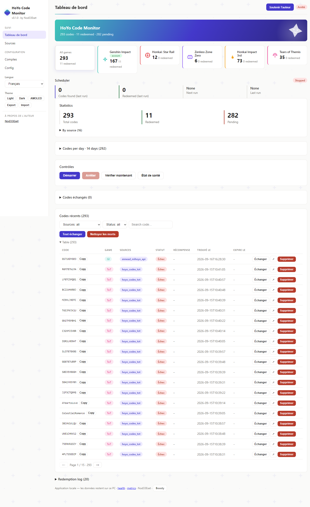
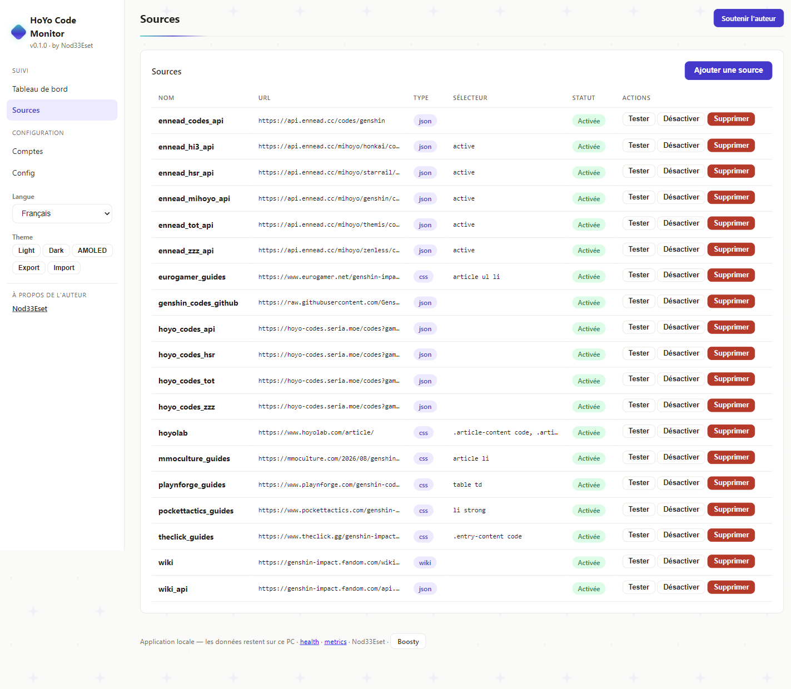
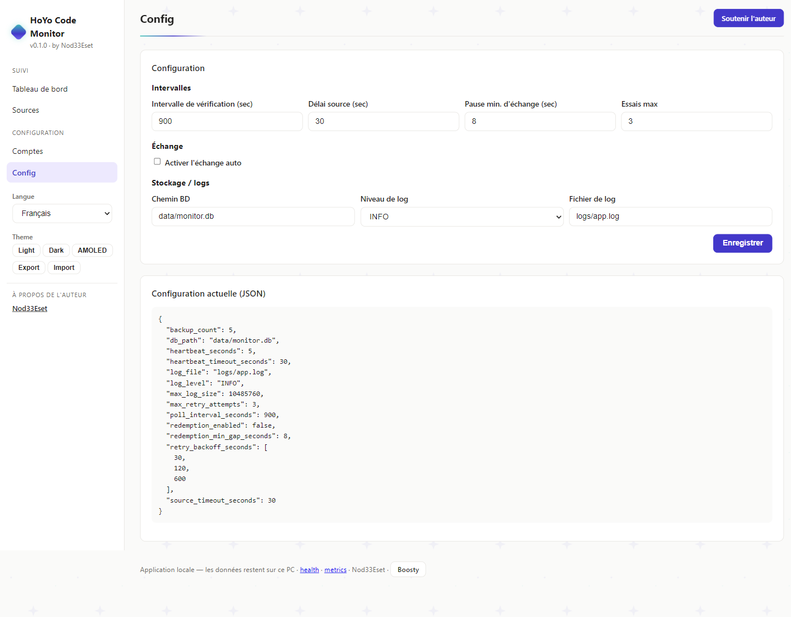
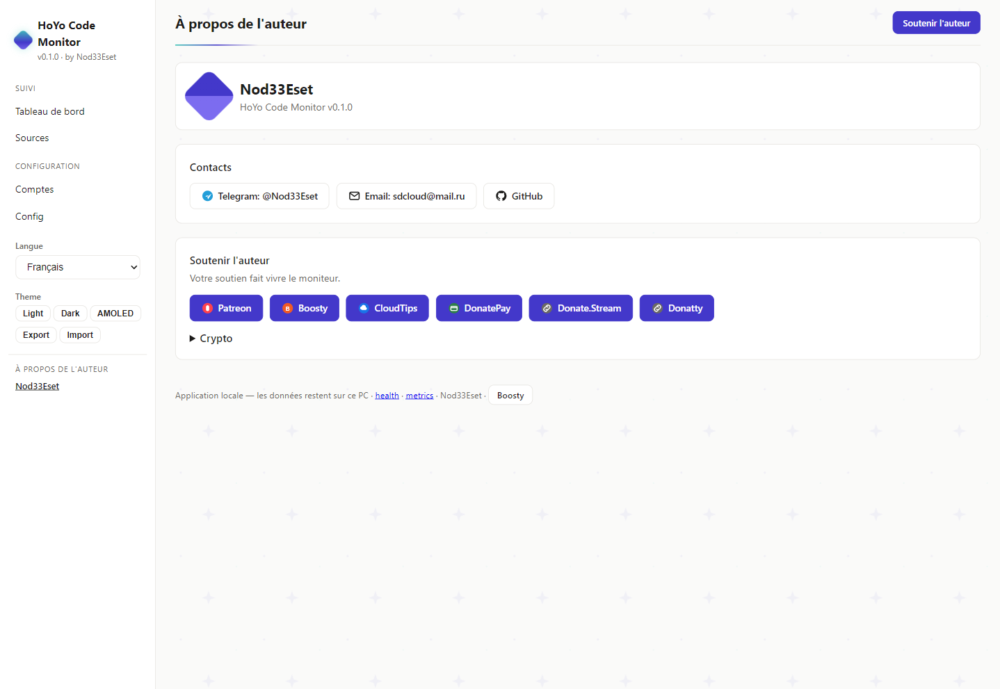

# HoYo Code Monitor

[](https://github.com/retvil/hoyo-code-monitor/releases) [](LICENSE) [](https://github.com/retvil/hoyo-code-monitor/releases)

**Ne ratez plus jamais un code promo HoYoverse — surveillance locale et échange auto pour 5 jeux, directement sur votre PC.**

[🇬🇧 English](README.md) | [🇷🇺 Русский](README.ru.md) | [🇩🇪 Deutsch](README.de.md) | **🇫🇷 Français** | [🇯🇵 日本語](README.ja.md) | [🇨🇳 中文](README.zh.md)

## De quoi s'agit-il ?

Les jeux HoYoverse publient régulièrement des codes promo à durée limitée — et ils expirent vite. **HoYo Code Monitor** surveille 16 sources de codes dans 5 jeux (Genshin Impact, Honkai: Star Rail, Zenless Zone Zero, Honkai Impact 3rd, Tears of Themis) et échange automatiquement les nouveaux codes sur vos comptes. Tout fonctionne en local sur votre PC : base SQLite, cookies chiffrés, aucune télémétrie, aucun cloud.

### Comment ça marche

1. Le planificateur interroge les sources activées, extrait les codes (`[A-Z0-9]{8,14}`), stocke les nouveaux.
2. Pour chaque compte avec échange auto : `GET webExchangeCdkey` avec les cookies du compte, pause de 8s entre les échanges.
3. Résultat enregistré : `success` → Done + récompense ; `-2017/-2018` → déjà échangé (compte comme Done) ; `-2001` expiré, `-2003` invalide/Chine uniquement.

## Fonctionnalités

- **Surveillance en arrière-plan** — vérifie les sources toutes les N minutes (configurable, 15 par défaut)
- **Échange auto** — échange les nouveaux codes via l'API Hoyolab `webExchangeCdkey` (opt-in, par compte)
- **Multi-sources** — Wiki, Wiki API, API JSON communautaires, sites de guides (16 préréglages)
- **Multi-comptes** — chaque compte a ses cookies chiffrés et son interrupteur
- **Statistiques** — total / échangés / en attente, par source, journal d'échange
- **Web UI** — tableau de bord local sur `http://127.0.0.1:8000` en 6 langues
- **Barre système** — icône avec activer/désactiver, menu d'intervalle, réglages en un clic
- **Cookies chiffrés** — Fernet (AES-128), clé dans env / trousseau OS / fichier local
- **Démarrage auto** — démarrage Windows optionnel

## Captures d'écran

<details>
<summary>Tableau de bord / Sources / Config / Auteur</summary>

| Tableau de bord | Sources | Config |
|---|---|---|
|  |  |  |

| Auteur |
|---|
|  |

</details>

## Sources (vérifiées en direct)

| Source | Type | Statut |
|---|---|---|
| Genshin Wiki (Fandom) | CSS | Peut renvoyer 403 (protection Fandom) |
| Genshin Wiki API | JSON | Fonctionne |
| `hoyo-codes.seria.moe` | JSON API | Fonctionne |
| `api.ennead.cc` (2 points) | JSON API | Fonctionne |
| Pocket Tactics, TheClick, Eurogamer, MMO Culture, Playnforge | Guides CSS | Fonctionnent |

## Builds prêtes

Téléchargez l'installeur depuis [Releases](https://github.com/retvil/hoyo-code-monitor/releases) :

- **Windows** — `hoyo-code-monitor-1.0.0-beta.3-setup.exe` (installation par utilisateur, sans droits admin)

Installation silencieuse : `setup.exe /S`. Composants optionnels : raccourci bureau, démarrage Windows.

> **Note :** à la première connexion via navigateur, l'appli télécharge Chromium (~170 Mo, une seule fois).

## Démarrage rapide

```powershell
# 1. Installez et lancez — l'appli vit dans la barre système
# 2. Ajoutez un compte (région : os_usa / os_euro / os_asia / os_cht)
genshin-code-monitor accounts add main <UID> <REGION>

# 3. Capturez les cookies une fois (le navigateur s'ouvre, connectez-vous une fois)
genshin-code-monitor accounts login main

# 4. Activez l'échange auto (ou interrupteur par compte dans la Web UI)
genshin-code-monitor config set redemption_enabled true
```

5. Ouvrez le tableau de bord : `http://127.0.0.1:8000` — Dashboard, Sources, Accounts, Config (sélecteur EN/RU/DE/FR/JA/ZH dans la barre latérale).

## Installation depuis les sources

Python 3.11+ requis ([python.org](https://python.org)).

```powershell
pip install -e .
# Navigateur Playwright pour les sources JS (optionnel)
python -m playwright install chromium
```

Mode barre système (recommandé) / vérification unique / Web UI :

```powershell
genshin-code-monitor tray
genshin-code-monitor run-once
python -m uvicorn src.web_ui:app --host 127.0.0.1 --port 8000
```

## FAQ

- **Code en Pending ?** Vérifiez les cookies (ils expirent), `redemption_enabled`, l'interrupteur du compte et l'erreur dans le journal.
- **`-1071 "Please log in"` ?** Relancez `accounts login` — jeu de cookies incomplet.
- **Où sont les données ?** `data/monitor.db`, `config.toml`, `logs/`, `data/.key`. Copiez `data/` pour sauvegarder.

## Auteur & soutien

Voir le bloc « À propos de l'auteur » dans le tableau de bord de l'application, ou ci-dessous :

**Crypto :**

- BTC : `bc1qunld3rsp37qf5gg69aune50y0qqkd0eugg7j97`
- TON : `UQDmvr4SKOxSION3Yky6aOgzAnCDXySPuAbG4EKJa5JUT7tC`
- USDT (TRC20) : `TBPJSSLu1mUcX54g9UyxUohYGf2fuRvbwd`
- USDT (ERC20) : `0x25CAED3776Ef5b18E03392bC5b254Bbd78E8180C`
- USDT (SOL) : `3qgN5z291CEcj2FUi2Zza5DioxKgNw72kC7P52pCcTrG`

## Licence

MIT
