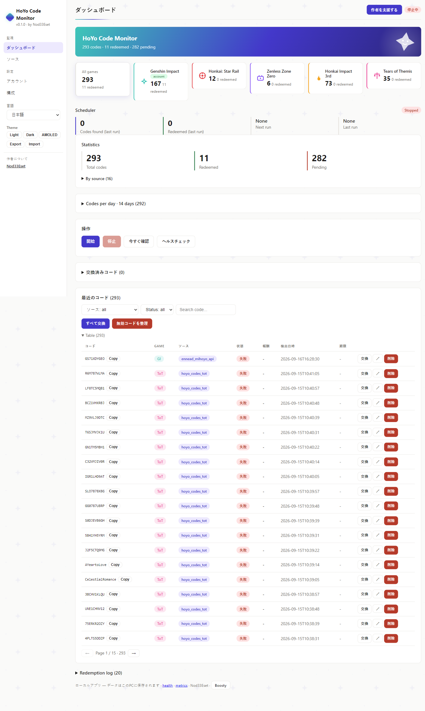
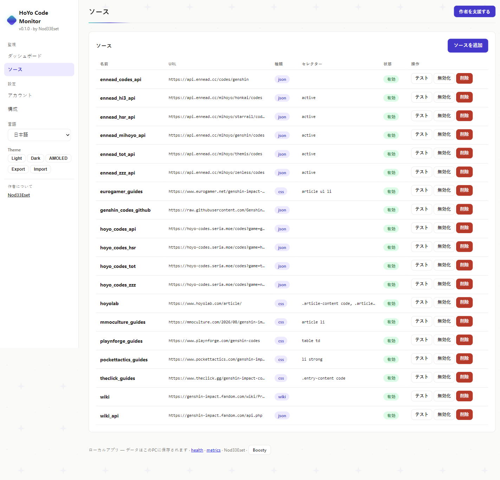
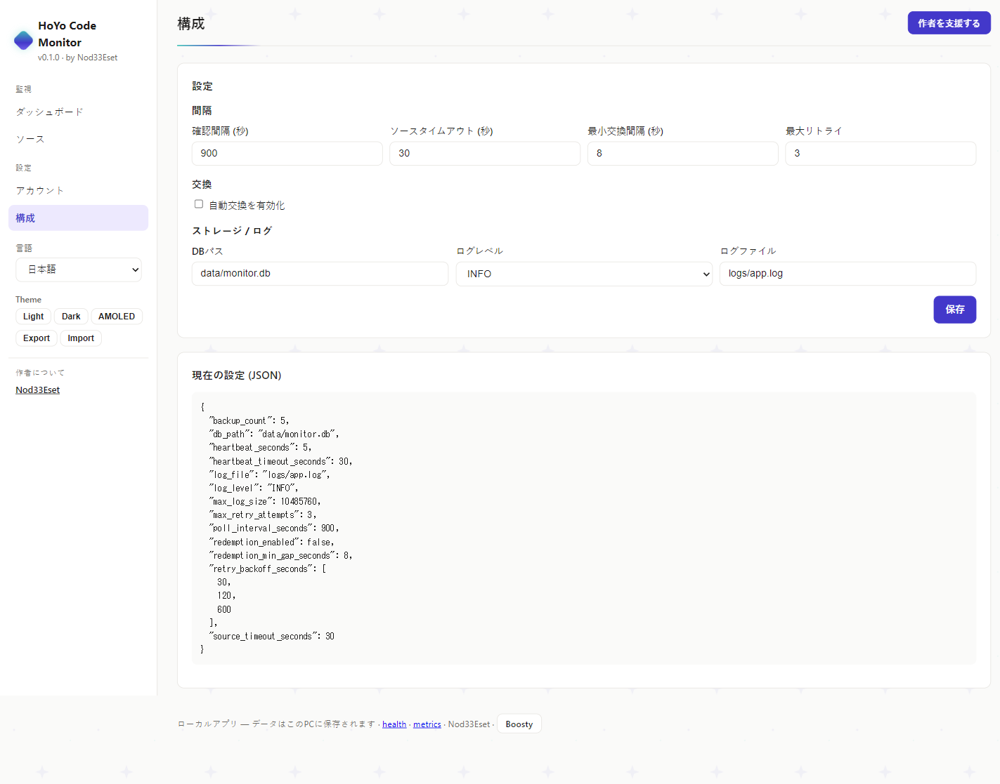
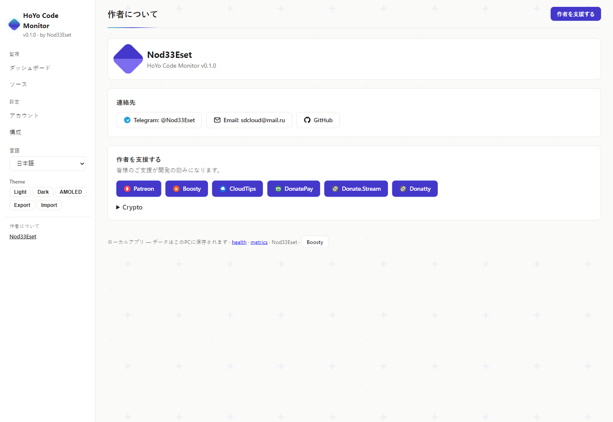

# HoYo Code Monitor

[](https://github.com/retvil/hoyo-code-monitor/releases) [](LICENSE) [](https://github.com/retvil/hoyo-code-monitor/releases)

**HoYoverseのプロモコードを見逃さない — 5つのゲームに対応したローカル監視・自動交換をあなたのPCで。**

[🇬🇧 English](README.md) | [🇷🇺 Русский](README.ru.md) | [🇩🇪 Deutsch](README.de.md) | [🇫🇷 Français](README.fr.md) | **🇯🇵 日本語** | [🇨🇳 中文](README.zh.md)

## これは何?

HoYoverseのゲームでは期限付きプロモコードが定期的に配布されます — そしてすぐ期限切れになります。**HoYo Code Monitor** は5つのゲーム (原神、崩壊:スターレイル、ゼンレスゾーンゼロ、崩壊3rd、未定事件簿) の16のコード情報源を監視し、新しいコードをあなたのアカウントに自動で交換します。すべてPC内のローカル動作です:SQLiteデータベース、暗号化Cookie、テレメトリーなし、クラウドなし。

### 仕組み

1. スケジューラが有効なソースを取得し、コード (`[A-Z0-9]{8,14}`) を抽出して保存。
2. 自動交換ONのアカウントごとにCookie付きで `GET webExchangeCdkey`、交換間隔8秒。
3. 結果を記録: `success` → Done + 報酬、`-2017/-2018` → 交換済み (Done扱い)、`-2001` 期限切れ、`-2003` 無効/中国限定。

## 機能

- **バックグラウンド監視** — N分ごとにソースを確認 (設定可能、デフォルト15分)
- **自動交換** — HoYolab `webExchangeCdkey` APIで新コードを交換 (オプトイン、アカウント別)
- **マルチソース** — Wiki、Wiki API、コミュニティJSON API、ガイドサイト (16プリセット)
- **マルチアカウント** — アカウントごとに暗号化Cookieと交換スイッチ
- **統計** — 合計 / 交換済み / 保留中、ソース別内訳、交換ログ
- **Web UI** — `http://127.0.0.1:8000` のローカルダッシュボード (6言語対応)
- **システムトレイ** — 有効/無効、スキャン間隔メニュー、ワンクリック設定
- **Cookie暗号化** — Fernet (AES-128)、鍵はenv / OSキーリング / ローカルファイル
- **自動起動** — Windowsログイン時の自動起動 (任意)

## スクリーンショット

<details>
<summary>ダッシュボード / ソース / 設定 / 作者</summary>

| ダッシュボード | ソース | 設定 |
|---|---|---|
|  |  |  |

| 作者 |
|---|
|  |

</details>

## ソース (実動作確認済み)

| ソース | 種類 | 状態 |
|---|---|---|
| Genshin Wiki (Fandom) | CSS | 403の場合あり (Fandom保護) |
| Genshin Wiki API | JSON | 動作 |
| `hoyo-codes.seria.moe` | JSON API | 動作 |
| `api.ennead.cc` (2エンドポイント) | JSON API | 動作 |
| Pocket Tactics、TheClick、Eurogamer、MMO Culture、Playnforge | CSSガイド | 動作 |

## 配布ビルド

[Releases](https://github.com/retvil/hoyo-code-monitor/releases) からインストーラをダウンロード:

- **Windows** — `hoyo-code-monitor-1.0.0-beta.3-setup.exe` (ユーザー単位インストール、管理者権限不要)

サイレントインストール: `setup.exe /S`。オプション: デスクトップショートカット、Windows自動起動。

> **注意:** 初回のブラウザログイン時にChromium (~170MB) を自動ダウンロードします (一度だけ)。

## クイックスタート

```powershell
# 1. インストールして起動 — アプリはシステムトレイに常駐
# 2. アカウント追加 (region: os_usa / os_euro / os_asia / os_cht)
genshin-code-monitor accounts add main <UID> <REGION>

# 3. Cookieを一度だけ取得 (ブラウザが開くので一度ログイン)
genshin-code-monitor accounts login main

# 4. 自動交換を有効化 (またはWeb UIでアカウント別に切替)
genshin-code-monitor config set redemption_enabled true
```

5. ダッシュボードを開く: `http://127.0.0.1:8000` — Dashboard、Sources、Accounts、Config (サイドバーでEN/RU/DE/FR/JA/ZH切替)。

## ソースからインストール

Python 3.11+ が必要です ([python.org](https://python.org))。

```powershell
pip install -e .
# JSソース用のPlaywrightブラウザ (任意)
python -m playwright install chromium
```

トレイモード (推奨) / 単発チェック / Web UI:

```powershell
genshin-code-monitor tray
genshin-code-monitor run-once
python -m uvicorn src.web_ui:app --host 127.0.0.1 --port 8000
```

## FAQ

- **Pendingのまま?** Cookie (失効します)、`redemption_enabled`、アカウントのスイッチ、交換ログのエラーを確認。
- **`-1071 "Please log in"`?** `accounts login` を再実行 — Cookieセットが不完全です。
- **データの場所?** `data/monitor.db`、`config.toml`、`logs/`、`data/.key`。バックアップは `data/` をコピー。

## 作者と支援

アプリのダッシュボード内「作者について」ブロック、または以下を参照:

**暗号資産:**

- BTC: `bc1qunld3rsp37qf5gg69aune50y0qqkd0eugg7j97`
- TON: `UQDmvr4SKOxSION3Yky6aOgzAnCDXySPuAbG4EKJa5JUT7tC`
- USDT (TRC20): `TBPJSSLu1mUcX54g9UyxUohYGf2fuRvbwd`
- USDT (ERC20): `0x25CAED3776Ef5b18E03392bC5b254Bbd78E8180C`
- USDT (SOL): `3qgN5z291CEcj2FUi2Zza5DioxKgNw72kC7P52pCcTrG`

## ライセンス

MIT
