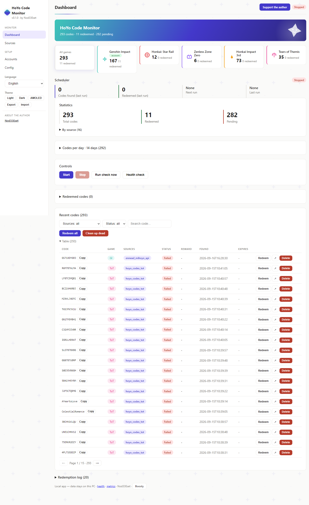
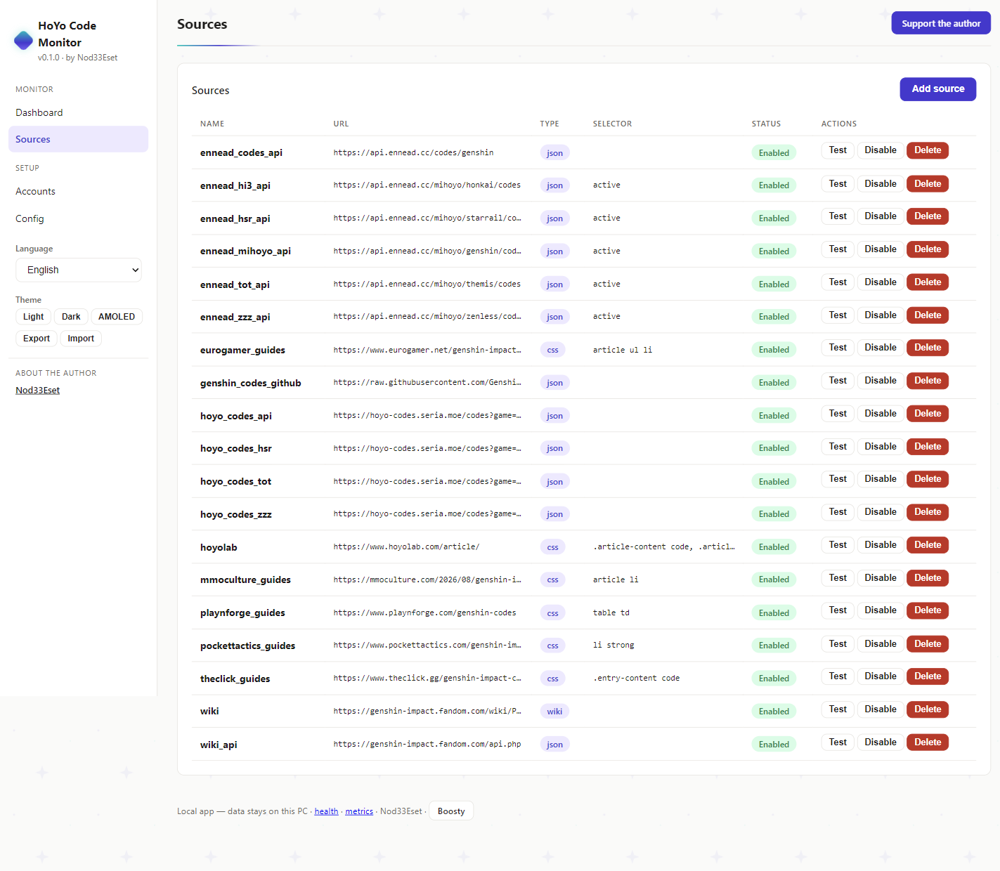
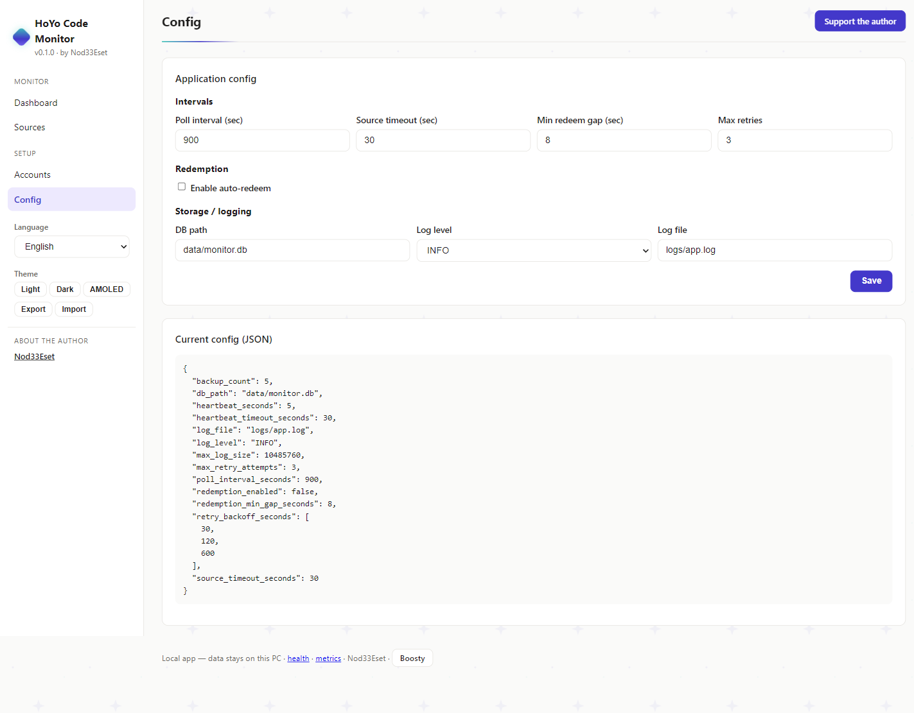
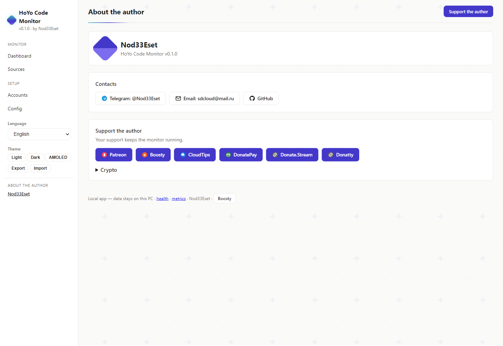

# HoYo Code Monitor

[](https://github.com/retvil/hoyo-code-monitor/releases) [](LICENSE) [](https://github.com/retvil/hoyo-code-monitor/releases)

**Never miss a HoYoverse promo code again — local monitoring and auto-redeem for 5 games, right on your PC.**

**🇬🇧 English** | [🇷🇺 Русский](README.ru.md) | [🇩🇪 Deutsch](README.de.md) | [🇫🇷 Français](README.fr.md) | [🇯🇵 日本語](README.ja.md) | [🇨🇳 中文](README.zh.md)

## What is this?

HoYoverse games regularly release time-limited promo codes — and they expire fast. **HoYo Code Monitor** watches 16 code sources across 5 games (Genshin Impact, Honkai: Star Rail, Zenless Zone Zero, Honkai Impact 3rd, Tears of Themis) and redeems new codes to your accounts automatically. Everything runs locally on your PC: SQLite database, encrypted cookies, no telemetry, no cloud.

### How it works

1. The scheduler polls enabled sources, extracts codes (`[A-Z0-9]{8,14}`), stores new ones.
2. For each account with auto-redeem ON: `GET webExchangeCdkey` with the account's cookies, 8s gap between redemptions.
3. Result recorded: `success` → Done + reward; `-2017/-2018` → already claimed (counts as Done); `-2001` expired, `-2003` invalid/CN-only.

## Features

- **Background monitoring** — checks sources every N minutes (configurable, default 15)
- **Auto-redeem** — redeems new codes via Hoyolab `webExchangeCdkey` API (opt-in, per account)
- **Multi-source** — Wiki, Wiki API, community JSON APIs, guide sites (16 presets, see table)
- **Multi-account** — each account has its own encrypted cookies and redeem toggle
- **Statistics** — total / redeemed / pending, per-source breakdown, redemption log
- **Web UI** — local dashboard at `http://127.0.0.1:8000` in 6 languages
- **System tray** — icon with enable/disable, scan-interval submenu, one-click settings
- **Encrypted cookies** — Fernet (AES-128), key in env / OS keyring / local file
- **Autostart** — optional Windows login autostart

## Screenshots

<details>
<summary>Dashboard / Sources / Config / Author</summary>

| Dashboard | Sources | Config |
|---|---|---|
|  |  |  |

| Author |
|---|
|  |

</details>

## Sources (verified live)

| Source | Type | Status |
|---|---|---|
| Genshin Wiki (Fandom) | CSS | May return 403 (Fandom protection) |
| Genshin Wiki API | JSON | Working |
| `hoyo-codes.seria.moe` | JSON API | Working |
| `api.ennead.cc` (x2 endpoints) | JSON API | Working |
| Pocket Tactics, TheClick, Eurogamer, MMO Culture, Playnforge | CSS guides | Working |

## Ready builds

Download the installer from [Releases](https://github.com/retvil/hoyo-code-monitor/releases):

- **Windows** — `hoyo-code-monitor-1.0.0-beta.3-setup.exe` (per-user install, no admin rights needed)

Silent install: `setup.exe /S`. Optional components: desktop shortcut, Windows autostart.

> **Note:** On first browser login the app downloads Chromium (~170MB, one-time).

## Quick start

```powershell
# 1. Install and launch — the app lives in the system tray
# 2. Add an account (region: os_usa / os_euro / os_asia / os_cht)
genshin-code-monitor accounts add main <UID> <REGION>

# 3. Capture cookies once (browser opens, you log in once)
genshin-code-monitor accounts login main

# 4. Enable auto-redeem (or toggle per account in the Web UI)
genshin-code-monitor config set redemption_enabled true
```

5. Open the dashboard: `http://127.0.0.1:8000` — Dashboard, Sources, Accounts, Config (EN/RU/DE/FR/JA/ZH switcher in sidebar).

## Install from source

Requires Python 3.11+ ([python.org](https://python.org)).

```powershell
pip install -e .
# Playwright browser for JS-rendered sources (optional)
python -m playwright install chromium
```

Run in tray (recommended) / one-shot check / Web UI:

```powershell
genshin-code-monitor tray
genshin-code-monitor run-once
python -m uvicorn src.web_ui:app --host 127.0.0.1 --port 8000
```

## FAQ

- **Code shows Pending?** Check cookies (they expire), `redemption_enabled`, per-account toggle, and the error in Redemption log.
- **`-1071 "Please log in"`?** Re-run `accounts login` — the cookie set was incomplete.
- **Data location?** `data/monitor.db`, `config.toml`, `logs/`, `data/.key`. Copy `data/` for backup.

## Author & support

See the "About the author" block in the app dashboard, or below:

**Crypto:**

- BTC: `bc1qunld3rsp37qf5gg69aune50y0qqkd0eugg7j97`
- TON: `UQDmvr4SKOxSION3Yky6aOgzAnCDXySPuAbG4EKJa5JUT7tC`
- USDT (TRC20): `TBPJSSLu1mUcX54g9UyxUohYGf2fuRvbwd`
- USDT (ERC20): `0x25CAED3776Ef5b18E03392bC5b254Bbd78E8180C`
- USDT (SOL): `3qgN5z291CEcj2FUi2Zza5DioxKgNw72kC7P52pCcTrG`

## License

MIT
