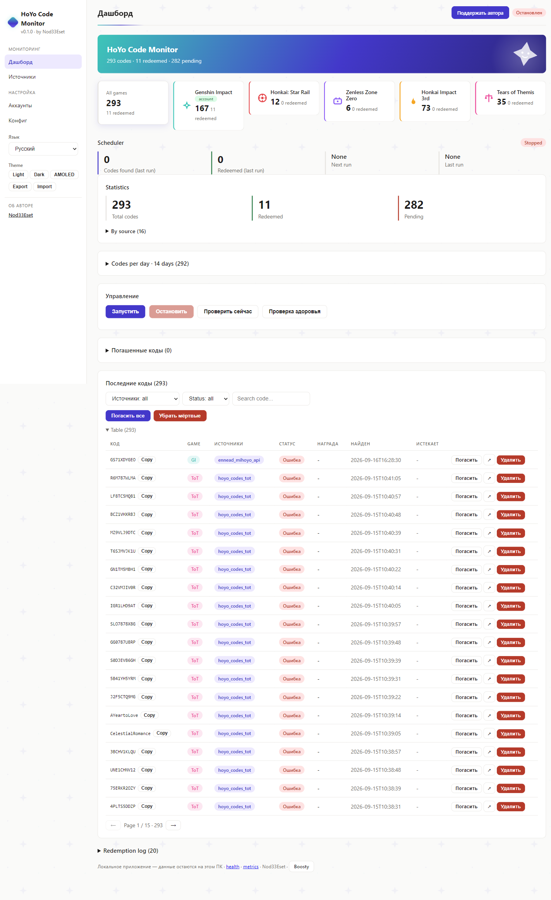
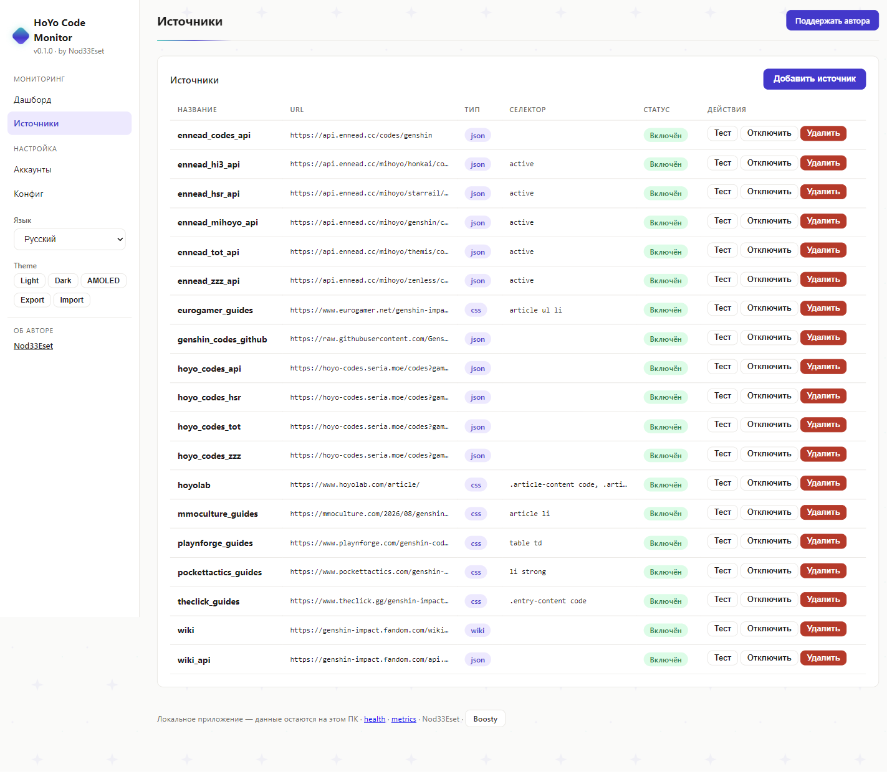
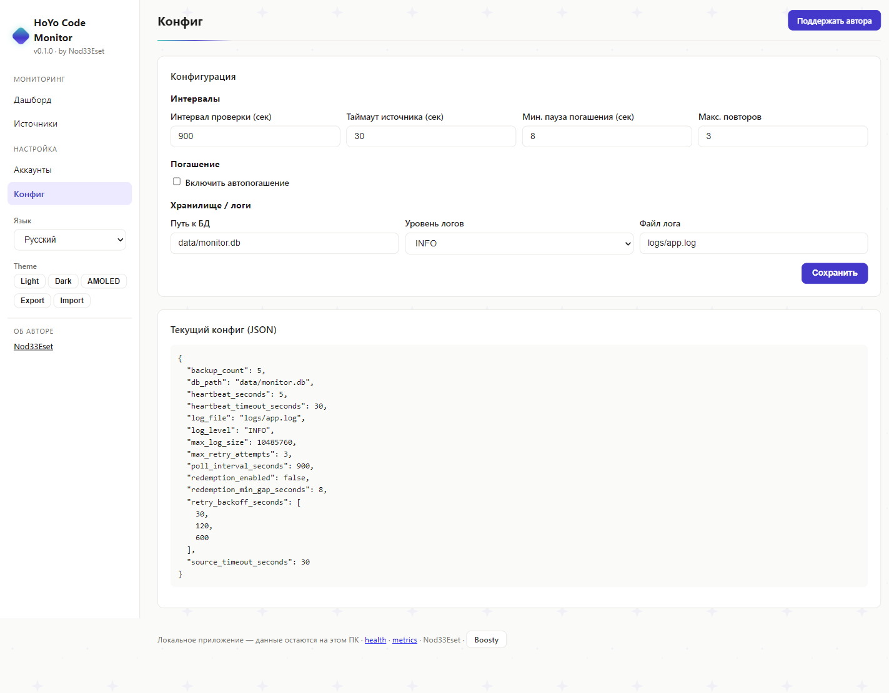
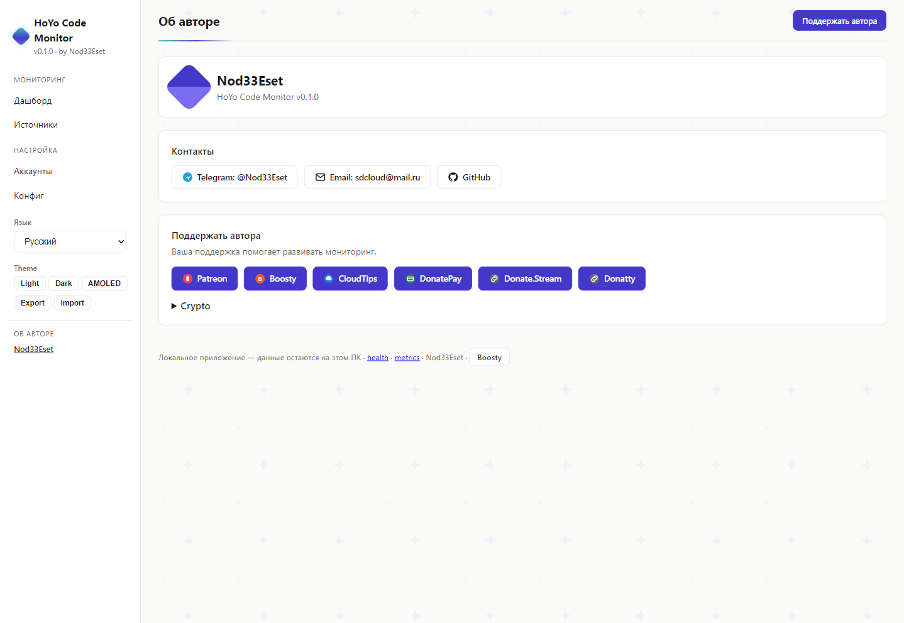

# HoYo Code Monitor

Локальное Windows-приложение для мониторинга источников промокодов Genshin Impact и автопогашения новых кодов через Hoyolab API. Всё остаётся на вашем ПК: SQLite-база, зашифрованные куки, никакой телеметрии и облаков.

> Читать на: [English](README.md) · [Deutsch](README.de.md) · [Français](README.fr.md) · [日本語](README.ja.md) · [中文](README.zh.md)

## Возможности

- **Фоновый мониторинг** — проверка источников каждые N минут (настраивается, по умолчанию 15)
- **Автопогашение** — погашение новых кодов через Hoyolab `webExchangeCdkey` API (опционально, отдельно для каждого аккаунта)
- **Мульти-источники** — Wiki, Wiki API, community JSON API, гайд-сайты (16 пресетов, см. таблицу)
- **Мульти-аккаунт** — у каждого аккаунта свои зашифрованные куки и свой тумблер погашения
- **Статистика** — всего / погашено / ожидают, разбивка по источникам, журнал погашений
- **Web UI** — локальный дашборд `http://127.0.0.1:8000` на 6 языках
- **Системный трей** — иконка с вкл/выкл, подменю периода сканирования, открытие настроек в один клик
- **Шифрование куков** — Fernet (AES-128), ключ в env / системном хранилище / локальном файле
- **Автозапуск** — опциональный старт при входе в Windows

## Скриншоты

| Дашборд | Источники | Настройки |
|---|---|---|
|  |  |  |

| Об авторе |
|---|
|  |

## Источники (проверены живьём)

| Источник | Тип | Статус |
|---|---|---|
| Genshin Wiki (Fandom) | CSS | Может отдавать 403 (защита Fandom) |
| Genshin Wiki API | JSON | Работает |
| `hoyo-codes.seria.moe` | JSON API | Работает |
| `api.ennead.cc` (2 эндпоинта) | JSON API | Работает |
| Pocket Tactics, TheClick, Eurogamer, MMO Culture, Playnforge | CSS-гайды | Работают |

## Установка

Требуется Python 3.11+.

```powershell
pip install -e .
# Браузер Playwright для JS-источников (опционально)
python -m playwright install chromium
```

## Использование

```powershell
# Добавить аккаунт + автозахват куков (откроется браузер, залогиньтесь один раз)
genshin-code-monitor accounts add main <UID> <REGION>   # регион: os_usa / os_euro / os_asia / os_cht
genshin-code-monitor accounts login main

# Включить автопогашение (или тумблером у аккаунта в Web UI)
genshin-code-monitor config set redemption_enabled true

# Запуск в трее (рекомендуется) / разовая проверка / Web UI
genshin-code-monitor tray
genshin-code-monitor run-once
python -m uvicorn src.web_ui:app --host 127.0.0.1 --port 8000
```

Web UI: `http://127.0.0.1:8000` — Dashboard, Sources, Accounts, Config (переключатель EN/RU/DE/FR/JA/ZH в сайдбаре).

## Как работает погашение

1. Планировщик опрашивает включённые источники, извлекает коды (`[A-Z0-9]{8,14}`), сохраняет новые.
2. Для каждого аккаунта с включённым автопогашением: `GET webExchangeCdkey` с куками аккаунта, пауза 8с.
3. Результат записывается: `success` → Done + награда; `-2017/-2018` → уже погашен (считается Done); `-2001` протух, `-2003` невалиден/только Китай.

## FAQ

- **Код висит в Pending?** Проверьте куки (протухают), `redemption_enabled`, тумблер у аккаунта и ошибку в журнале погашений.
- **`-1071 "Please log in"`?** Повторите `accounts login` — набор куков неполный.
- **Где данные?** `data/monitor.db`, `config.toml`, `logs/`, `data/.key`. Для бэкапа скопируйте `data/`.

## Автор и поддержка

См. блок «Об авторе» на дашборде приложения (контакты, ссылки для доната и криптокошельки настраиваются там).

## Лицензия

MIT
