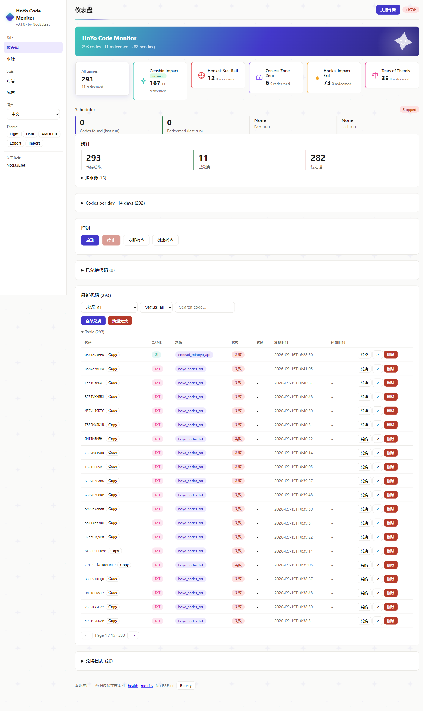
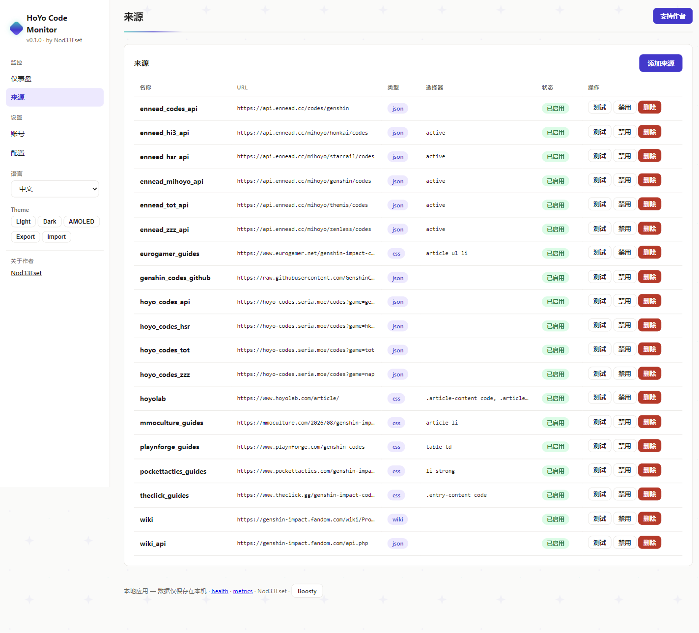
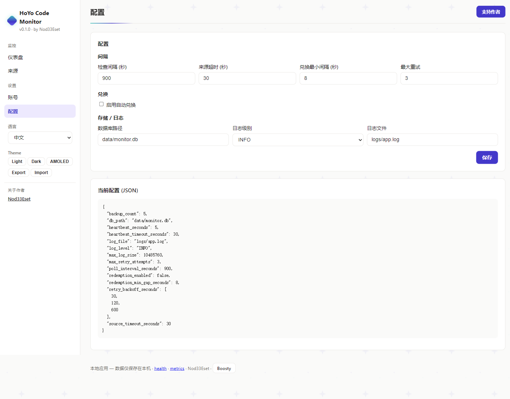
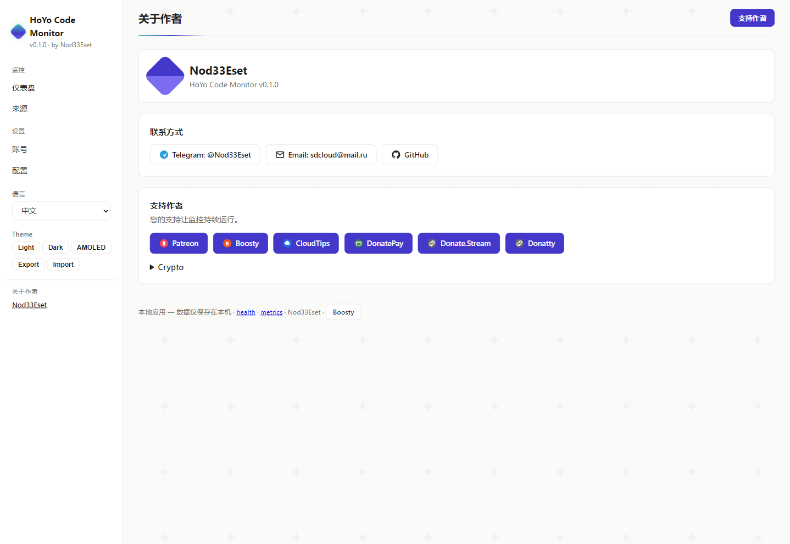

# HoYo Code Monitor

本地 Windows 应用：监控原神兑换码来源，并通过 HoYolab API 自动兑换新码。所有数据保留在本机：SQLite 数据库、加密 Cookie，无遥测，无云端。

> 其他语言版本：[English](README.md) · [Русский](README.ru.md) · [Deutsch](README.de.md) · [Français](README.fr.md) · [日本語](README.ja.md)

## 功能

- **后台监控** — 每 N 分钟检查来源 (可配置，默认 15 分钟)
- **自动兑换** — 通过 HoYolab `webExchangeCdkey` API 兑换新码 (可选，按账号开关)
- **多来源** — Wiki、Wiki API、社区 JSON API、攻略站 (16 个预设)
- **多账号** — 每个账号独立加密 Cookie 和兑换开关
- **统计** — 总数 / 已兑换 / 待处理、按来源统计、兑换日志
- **Web 界面** — 本地仪表盘 `http://127.0.0.1:8000`，支持 6 种语言
- **系统托盘** — 启用/禁用图标、扫描间隔菜单、一键打开设置
- **Cookie 加密** — Fernet (AES-128)，密钥存于 env / 系统钥匙串 / 本地文件
- **开机自启** — 可选的 Windows 登录自启

## 截图

| 仪表盘 | 来源 | 设置 |
|---|---|---|
|  |  |  |

| 作者 |
|---|
|  |

## 来源 (已实测)

| 来源 | 类型 | 状态 |
|---|---|---|
| Genshin Wiki (Fandom) | CSS | 可能返回 403 (Fandom 防护) |
| Genshin Wiki API | JSON | 可用 |
| `hoyo-codes.seria.moe` | JSON API | 可用 |
| `api.ennead.cc` (2 个接口) | JSON API | 可用 |
| Pocket Tactics、TheClick、Eurogamer、MMO Culture、Playnforge | CSS 攻略 | 可用 |

## 安装

需要 Python 3.11+。

```powershell
pip install -e .
# JS 来源所需的 Playwright 浏览器 (可选)
python -m playwright install chromium
```

## 使用

```powershell
# 添加账号 + 自动获取 Cookie (会打开浏览器，登录一次即可)
genshin-code-monitor accounts add main <UID> <REGION>   # region: os_usa / os_euro / os_asia / os_cht
genshin-code-monitor accounts login main

# 启用自动兑换 (或在 Web 界面按账号开关)
genshin-code-monitor config set redemption_enabled true

# 托盘模式 (推荐) / 单次检查 / Web 界面
genshin-code-monitor tray
genshin-code-monitor run-once
python -m uvicorn src.web_ui:app --host 127.0.0.1 --port 8000
```

Web 界面：`http://127.0.0.1:8000` — Dashboard、Sources、Accounts、Config (侧边栏可切换 EN/RU/DE/FR/JA/ZH)。

## 兑换原理

1. 调度器抓取已启用的来源，提取兑换码 (`[A-Z0-9]{8,14}`) 并保存新增。
2. 对每个开启自动兑换的账号：携带账号 Cookie 调用 `GET webExchangeCdkey`，间隔 8 秒。
3. 记录结果：`success` → Done + 奖励；`-2017/-2018` → 已兑换过 (记为 Done)；`-2001` 已过期，`-2003` 无效/仅限国服。

## FAQ

- **一直 Pending？** 检查 Cookie (会过期)、`redemption_enabled`、账号开关以及兑换日志中的错误。
- **`-1071 "Please log in"`？** 重新运行 `accounts login` —— Cookie 不完整。
- **数据在哪？** `data/monitor.db`、`config.toml`、`logs/`、`data/.key`。备份时复制 `data/` 即可。

## 作者与支持

见应用仪表盘内的“关于作者”区块 (联系方式、打赏链接和加密地址均可配置)。

## 许可证

MIT
